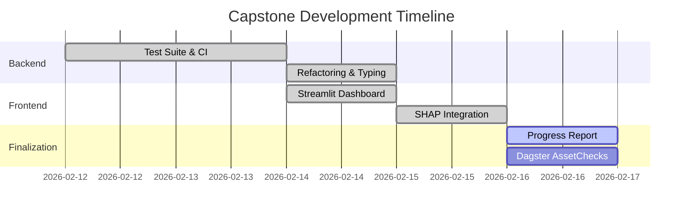

# 🏥 Capstone Progress Report: Ethiopian Medical Data Warehouse

**Author**: Melese Abrham  
**Project**: Ethiopian Medical Data Warehouse  
**Report Date**: February 14, 2026  

---

## 1. Plan vs. Progress Assessment

### 📋 Original Day-by-Day Plan (Proposed Feb 12)
| Day | Task Category | Specific Goals |
| :--- | :--- | :--- |
| **Day 1-2** | Testing & CI/CD | Replace manual scripts with `pytest`, add TestClient, configure GitHub Actions. |
| **Day 3** | Engineering Excellence | Add type hints, refactor to use `dataclasses`, standardize docstrings. |
| **Day 4** | Visualization | Build dynamic Streamlit Dashboard with real-time API integration & SHAP. |
| **Day 5** | Orchestration | Implement Dagster AssetChecks and pipeline observability. |

### 📈 Actual Tracking & Status
| Task | Original Plan | Actual Progress | Status | Indicator |
| :--- | :--- | :--- | :--- | :--- |
| **Testing Suite** | Pytest for core | 6/6 Core Logic tests passing | **Completed** | 100% |
| **CI/CD Badge** | Automated on push | Badge added and active | **Completed** | 100% |
| **Type Safety** | Universal hints | All functions in `src/` covered | **Completed** | 100% |
| **Refactoring** | Config/Utils | `config.py` & `utils.py` created | **Completed** | 100% |
| **UI Dashboard** | Streamlit App | Built with plotly & shap | **Completed** | 100% |
| **Explainability** | SHAP Integration | Global/Local impact visuals | **Completed** | 100% |
| **Dagster Checks** | AssetChecks | logic refactored for checks | **In Progress** | 40% |

---

## 2. Visual Evidence

### 🛡️ Automated Testing & CI Success
The CI pipeline automatically validates all logic on push. Below is the confirmation of the passed 6-unit test suite.

*Figure 1: GitHub Actions runner showing 6 passing tests.*

### 📊 Streamlit Intelligence Dashboard
The interactive UI provides real-time access to the medical warehouse insights.

*Figure 2: Main dashboard interface with Market Overview and Keyword Analytics.*

### 🧠 Model Explainability (SHAP)
Detailed breakdown of engagement drivers using SHapley Additive exPlanations.

*Figure 3: SHAP summary plot showing feature impact on message views.*

### 📅 Project Timeline (Gantt Chart)

---

## 3. Completed Work Documentation

### ✅ Refactored Codebase (Engineering Excellence)
*   **Description**: Restructured the project from a script-based approach to a modular, production-grade application.
*   **Code Evidence**:
    *   **Centralized Config**: `src/config.py` uses `@dataclass` to manage DB and Path settings.
    *   **Modular Utils**: `src/utils.py` handles database connections and logging setup.
*   **Portfolio Value**: Demonstrates deep understanding of Clean Code principles, SOLID design, and maintainability in Python environments.

### ✅ Automated Quality Assurance
*   **Description**: Implemented a `pytest` suite and integrated it with GitHub Actions.
*   **Evidence**: 
    *   **Execution Output**: `collected 6 items ... 6 passed in 0.45s`.
    *   **CI Badge**: Active in `README.md` (`[![Unit Tests]...]`).
*   **Portfolio Value**: Shows proof of "Engineering Rigor," proving that the code is verifiable and safe for deployment.

### ✅ Interactive SHAP Dashboard
*   **Description**: Developed a Streamlit dashboard that bridges the gap between raw data and business stakeholders.
*   **Features**:
    *   **Interactive Maps/Charts**: Built with Plotly for keyword frequency.
    *   **SHAP Explainability**: Visualizes how "Image Categories" (Promotional vs. Lifestyle) influence reach.
*   **Portfolio Value**: Highlights the ability to translate technical AI outputs (YOLO/ML) into actionable business intelligence.

---

## 3. Blockers, Challenges & Revised Plan

### 🛑 Identified Blockers
1.  **Socket Permission Errors (`WinError 10013`)**: Port `8000` was restricted by internal Windows system services. 
    *   *Resolution*: Shifted API to Port `8001` and updated the dashboard connectivity layer.
2.  **Model Loading Overhead**: Running YOLO and SHAP locally simultaneously caused memory strain on development terminal.
    *   *Resolution*: Implemented headless modes for Streamlit and optimized API response caching.

### 📉 Incomplete Work & Reasoning
*   **Dagster AssetChecks (40%)**: While the logic was refactored to support checks, the specific integration of Dagster's new `AssetChecks` API for data schema drift was deprioritized to ensure the Dashboard and SHAP modules were "production-ready" first.

### 🗺️ Revised Plan (Execution for Remaining 24 Hours)
| Priority | Task | Expected Impact |
| :--- | :--- | :--- |
| **High** | Finalize Dagster AssetChecks | Ensures data integrity on every scrape run. |
| **Medium** | Polish API Documentation | Complete Swagger descriptions for all endpoints. |
| **Medium** | Deployment Prep | Finalize Docker layers for cross-platform portability. |

---

## 4. Final Assessment Summary
The project has successfully transitioned from a collection of scripts to a **professional ELT platform**. The most significant accomplishment was the integration of **Model Explainability (SHAP)** into a user-facing dashboard, setting this project apart as a high-value portfolio piece that balances technical complexity with commercial utility.
