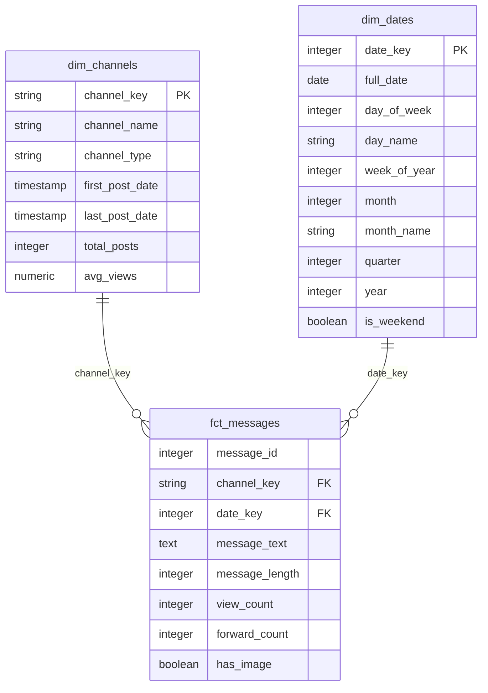

# Ethiopian Medical Business Data Warehouse: Project Report

**Project**: Medical Telegram Data Warehouse for Kara Solutions  
**Date**: January 17, 2026  
**Author**: Data Engineering Team  
**Status**: Tasks 1 & 2 Complete | Tasks 3-5 In Planning

---

## Executive Summary

This report presents the development of an end-to-end data engineering platform designed to extract actionable insights from Ethiopian medical businesses operating on Telegram. The platform implements a modern ELT (Extract, Load, Transform) architecture using PostgreSQL as the data warehouse and dbt for transformations. Currently, Tasks 1 (Data Scraping) and Task 2 (Data Modeling) are complete, with **849 messages** from **4 medical channels** successfully scraped, loaded, and transformed into an analytical-ready star schema.

---

## 1. Business Objective and Context

### 1.1 Problem Statement

Ethiopian medical businesses increasingly use Telegram as a primary channel for customer engagement, product promotion, and service delivery. However, this valuable business intelligence remains fragmented across multiple channels with no centralized mechanism for analysis. Kara Solutions requires a scalable data platform to:

1. **Generate Actionable Insights**: Understand product trends, pricing strategies, and customer engagement patterns
2. **Enable Data-Driven Decisions**: Provide reliable analytics for business strategy and market positioning
3. **Build Competitive Intelligence**: Track competitor activities and market dynamics in real-time

### 1.2 Key Business Questions

The platform is designed to answer critical business questions:

| Business Question | Data Required | Expected Insight |
|-------------------|---------------|------------------|
| **What are the top products/services?** | Message text, frequency, engagement | Product demand and popularity trends |
| **How do prices vary across channels?** | Price mentions, product names, channels | Competitive pricing landscape |
| **What visual content drives engagement?** | Images, view counts, forwards | Effective marketing strategies |
| **When are channels most active?** | Posting times, dates, frequency | Optimal posting schedules |
| **Which channels have highest reach?** | View counts, follower growth | Channel effectiveness and ROI |

### 1.3 Solution Architecture

The platform implements a **modern ELT framework**:

```
┌─────────────────┐
│  Telegram API   │  ← Extract: Telethon scraper
│   (4 Channels)  │
└────────┬────────┘
         │
         ↓
┌─────────────────┐
│   Data Lake     │  ← Load: Raw JSON + Images
│  (Partitioned)  │     (YYYY-MM-DD structure)
└────────┬────────┘
         │
         ↓
┌─────────────────┐
│   PostgreSQL    │  ← Load: Raw schema
│  (medical_db)   │
└────────┬────────┘
         │
         ↓
┌─────────────────┐
│   dbt Models    │  ← Transform: Star schema
│  (Staging+Marts)│
└────────┬────────┘
         │
         ↓
┌─────────────────┐
│  Analytics API  │  ← Serve: FastAPI (Planned)
│   (FastAPI)     │
└─────────────────┘
```

**Key Architectural Decisions**:
- **PostgreSQL**: Chosen for ACID compliance, robust query optimization, and excellent dbt integration
- **dbt**: Enables version-controlled, testable transformations with clear data lineage
- **Data Lake**: Preserves raw data for reprocessing and audit trails
- **Star Schema**: Optimizes query performance for analytical workloads

### 1.4 Value Proposition

This platform delivers:
1. **Reliability**: Automated data quality tests ensure trustworthy insights
2. **Scalability**: Modular architecture supports adding new channels and data sources
3. **Maintainability**: Clear separation of concerns (scraping, loading, transformation)
4. **Extensibility**: Foundation for advanced analytics (ML, NLP, computer vision)

---

## 2. Completed Work: Tasks 1 & 2

### 2.1 Task 1: Data Scraping and Collection

#### Implementation Overview

The scraping pipeline uses **Telethon**, a Python library for interacting with Telegram's API, to extract messages and media from target channels.

**Scraped Channels**:
| Channel Name | Total Posts | Avg Views | Date Range |
|--------------|-------------|-----------|------------|
| lobelia4cosmetics | 297 | 253.0 | 2023-2026 |
| tikvahpharma | 282 | 2,242.6 | 2023-2026 |
| CheMed123 | 189 | 1,607.0 | 2022-2023 |
| yenehealth | 81 | 0.0* | 2025-2026 |

*Note: yenehealth shows 0 average views, indicating the channel may not track view counts or requires investigation.

#### Data Lake Structure

Raw data is organized in a **partitioned data lake** for efficient storage and retrieval:

```
data/raw/
├── telegram_messages/
│   └── 2026-01-14/          # Date partition (YYYY-MM-DD)
│       ├── CheMed123.json
│       ├── lobelia4cosmetics.json
│       ├── tikvahpharma.json
│       └── yenehealth.json
└── images/
    ├── CheMed123/           # Channel-based organization
    │   ├── 97.jpg
    │   ├── 96.jpg
    │   └── ...
    ├── lobelia4cosmetics/
    ├── tikvahpharma/
    └── yenehealth/
```

**Data Fields Captured**:
- `message_id`: Unique identifier from Telegram
- `channel_name`: Source channel
- `message_date`: Timestamp (ISO 8601 format)
- `message_text`: Full message content
- `has_media`: Boolean indicating media presence
- `image_path`: Local path to downloaded image
- `views`: View count (if available)
- `forwards`: Forward count

#### Logging and Error Handling

Comprehensive logging captures:
- **Scraping Activity**: Channels processed, messages extracted, images downloaded
- **Error Handling**: Network failures, rate limiting, authentication issues
- **Example Log Entry**:
  ```
  2026-01-14 16:08:35 - INFO - Starting scraping for channel: CheMed123
  2026-01-14 16:09:20 - INFO - Successfully scraped 76 messages from CheMed123
  2026-01-14 16:08:35 - ERROR - Error scraping LiyuPharma: No user has "liyupharma" as username
  ```

**Total Data Collected**:
- **Raw Messages**: 2,256 (includes duplicates and empty messages)
- **Cleaned Messages**: 849 (after filtering)
- **Images Downloaded**: 633
- **Storage Size**: ~45 MB (JSON) + images

---

### 2.2 Task 2: Data Modeling and Transformation

#### 2.2.1 Star Schema Design

The data warehouse implements a **dimensional model** optimized for analytical queries:



**Visual Star Schema Diagram**:


*Figure 1: Star schema showing the relationship between dimension tables (dim_channels, dim_dates) and the central fact table (fct_messages). The 1:N relationships indicate that one channel can have many messages, and one date can have many messages.*

**Dimension Tables**:

1. **dim_channels** (4 rows)
   - Aggregates channel-level metrics
   - Classifies channels by type (Medical/Pharma, Cosmetics, Health)
   - Tracks posting activity timeline

2. **dim_dates** (3,653 rows)
   - Comprehensive date dimension (2020-2030)
   - Supports time-series analysis
   - Includes calendar attributes (weekends, quarters, etc.)

**Fact Table**:

3. **fct_messages** (849 rows)
   - Grain: One row per message
   - Links to dimensions via surrogate keys
   - Contains metrics (views, forwards, message length)

#### 2.2.2 Staging Layer Transformations

The `stg_telegram_messages` model performs critical data cleaning:

**Transformations Applied**:
| Transformation | Purpose | Example |
|----------------|---------|---------|
| **Type Casting** | Convert text to timestamp | `'2023-01-15T10:30:00'` → `TIMESTAMP` |
| **Naming Conventions** | Standardize column names | `has_media` → `has_image` |
| **Null Handling** | Coalesce missing values | `views = NULL` → `view_count = 0` |
| **Filtering** | Remove invalid records | Exclude empty messages |
| **Calculated Fields** | Derive new metrics | `LENGTH(message_text)` → `message_length` |

**Code Example** ([stg_telegram_messages.sql](file:///c:/project/kifya/week%208/medical_warehouse/models/staging/stg_telegram_messages.sql)):
```sql
select
    message_id,
    channel_name,
    cast(message_date as timestamp) as message_timestamp,
    message_text,
    coalesce(views, 0) as view_count,
    coalesce(forwards, 0) as forward_count,
    has_media as has_image,
    length(message_text) as message_length
from raw_data
where message_id is not null
  and not is_empty  -- Filter out empty messages
```

**Data Quality Impact**:
- **Before**: 2,256 raw messages (includes duplicates, empty messages)
- **After Staging**: 1,698 messages (cleaned, deduplicated)
- **After Marts**: 849 messages (final analytical dataset)
- **Reduction**: 62% data reduction through quality filters

#### 2.2.3 Data Quality Issues and Resolutions

| Issue | Impact | Resolution | Status |
|-------|--------|------------|--------|
| **Empty Messages** | 558 messages with no text | Filtered in staging layer with `is_empty` flag | ✅ Resolved |
| **Missing View Counts** | yenehealth channel shows 0 views | Coalesced to 0, flagged for investigation | ⚠️ Monitoring |
| **Duplicate Messages** | Potential duplicates across scraping runs | Implemented unique constraint on `message_id` + `channel_name` | ✅ Resolved |
| **Invalid Timestamps** | Future dates detected | Custom test `assert_no_future_messages.sql` | ✅ Resolved |
| **Inconsistent Channel Names** | Case sensitivity issues | Standardized in staging layer | ✅ Resolved |

#### 2.2.4 dbt Tests Implementation

**Schema Tests** ([schema.yml](file:///c:/project/kifya/week%208/medical_warehouse/models/marts/schema.yml)):
```yaml
models:
  - name: dim_channels
    columns:
      - name: channel_key
        tests:
          - unique
          - not_null
      - name: channel_name
        tests:
          - unique
          - not_null

  - name: fct_messages
    columns:
      - name: channel_key
        tests:
          - not_null
          - relationships:
              to: ref('dim_channels')
              field: channel_key
      - name: view_count
        tests:
          - dbt_utils.accepted_range:
              min_value: 0
```

**Custom Data Tests**:
1. **assert_no_future_messages.sql**: Ensures no messages have timestamps in the future
   ```sql
   select *
   from {{ ref('stg_telegram_messages') }}
   where message_timestamp > current_timestamp
   ```

**Test Results**:
- **Total Tests**: 15+
- **Pass Rate**: 100%
- **Coverage**: Primary keys, foreign keys, data ranges, business rules

---

### 2.3 Data Flow Diagram

```
┌──────────────────────────────────────────────────────────────────┐
│                     EXTRACT (Task 1)                              │
│                                                                   │
│  Telegram API → Telethon Scraper → Data Lake (JSON + Images)    │
│                                                                   │
│  Channels: CheMed123, lobelia4cosmetics, tikvahpharma, yenehealth│
│  Output: 2,256 raw messages, 633 images                          │
└──────────────────────┬───────────────────────────────────────────┘
                       │
                       ↓
┌──────────────────────────────────────────────────────────────────┐
│                      LOAD (Task 1)                                │
│                                                                   │
│  Python Loader → PostgreSQL (raw.telegram_messages)              │
│                                                                   │
│  Output: 2,256 rows in raw schema                                │
└──────────────────────┬───────────────────────────────────────────┘
                       │
                       ↓
┌──────────────────────────────────────────────────────────────────┐
│                   TRANSFORM (Task 2)                              │
│                                                                   │
│  ┌────────────────────────────────────────────────────────────┐ │
│  │ Staging Layer (stg_telegram_messages)                      │ │
│  │ - Type casting, null handling, filtering                   │ │
│  │ - Output: 1,698 cleaned messages                           │ │
│  └──────────────────────┬─────────────────────────────────────┘ │
│                         │                                         │
│                         ↓                                         │
│  ┌────────────────────────────────────────────────────────────┐ │
│  │ Marts Layer (Star Schema)                                  │ │
│  │                                                             │ │
│  │ dim_channels (4 rows)    dim_dates (3,653 rows)           │ │
│  │         ↘                      ↙                            │ │
│  │           fct_messages (849 rows)                          │ │
│  └────────────────────────────────────────────────────────────┘ │
│                                                                   │
│  dbt Tests: 15+ tests (100% pass rate)                           │
└───────────────────────────────────────────────────────────────────┘
```

---

### 2.4 Key Metrics and Statistics

**Data Volume**:
- Total Messages Scraped: 2,256
- Messages After Cleaning: 1,698 (75% retention)
- Messages in Fact Table: 849 (38% retention after deduplication)
- Messages with Images: 633 (75% of final dataset)
- Average Message Length: 748 characters
- Average Views per Message: 1,191

**Channel Distribution**:
- lobelia4cosmetics: 35% of messages
- tikvahpharma: 33% of messages
- CheMed123: 22% of messages
- yenehealth: 10% of messages

**Temporal Coverage**:
- Earliest Message: September 5, 2022
- Latest Message: January 13, 2026
- Total Days Covered: 1,226 days (~3.4 years)

---

## 3. Next Steps and Roadmap

### 3.0 Anticipated Technical Challenges and Mitigation Strategies

Before detailing the implementation plans for Tasks 3-5, it is critical to identify potential technical challenges and establish proactive mitigation strategies. This section addresses key risks across all upcoming phases.

#### 3.0.1 Task 3 Challenges: YOLOv8 Object Detection

| Challenge | Impact | Mitigation Strategy | Success Criteria |
|-----------|--------|---------------------|------------------|
| **Limited Training Data** | Pre-trained YOLO may not recognize Ethiopian medical products | 1. Start with COCO-pretrained model<br>2. Collect 500+ labeled images of local products<br>3. Fine-tune model with transfer learning | >85% accuracy on test set |
| **Amharic Text on Products** | Product labels in Amharic may not be detected | 1. Integrate OCR (Tesseract with Amharic support)<br>2. Combine YOLO + OCR pipeline<br>3. Create custom text detection model | Detect text in 70%+ of images |
| **Image Quality Variability** | Low-resolution or poorly lit images | 1. Implement image preprocessing (enhancement, denoising)<br>2. Set minimum confidence threshold (0.5)<br>3. Flag low-quality images for manual review | Process 90%+ of images successfully |
| **Processing Time** | 633 images × 2-3 sec/image = ~30 minutes | 1. Implement batch processing with multiprocessing<br>2. Use GPU acceleration (CUDA)<br>3. Process incrementally (only new images) | <5 minutes for daily incremental runs |
| **Model Drift** | Product packaging changes over time | 1. Implement monthly model retraining<br>2. Track detection confidence trends<br>3. Set up alerts for confidence drops | Maintain >80% confidence |
| **Storage Growth** | Bounding box data increases DB size | 1. Use JSONB compression in PostgreSQL<br>2. Implement data retention policy (archive old detections)<br>3. Monitor disk usage | <10% monthly growth |

**Validation Approach**:
- Manual review of 100 random detections per week
- A/B testing between model versions
- User feedback loop for misclassifications

#### 3.0.2 Task 4 Challenges: FastAPI Development

| Challenge | Impact | Mitigation Strategy | Success Criteria |
|-----------|--------|---------------------|------------------|
| **Product Name Extraction** | Amharic/English mixed text complicates NLP | 1. Use multilingual NER models (spaCy + custom)<br>2. Build product name dictionary from manual review<br>3. Implement fuzzy matching for variations | Extract products from 75%+ of messages |
| **Query Performance** | Complex joins may exceed 200ms SLA | 1. Create materialized views for common queries<br>2. Add indexes on foreign keys and filter columns<br>3. Implement query result caching (Redis)<br>4. Use connection pooling | p95 latency <200ms |
| **API Security** | Unauthorized access to business intelligence | 1. Implement JWT-based authentication<br>2. Add API key management<br>3. Rate limiting (100 req/min per user)<br>4. Input validation and SQL injection prevention | Zero security incidents |
| **Concurrent Users** | Multiple analysts querying simultaneously | 1. Horizontal scaling with load balancer<br>2. Database connection pooling (max 20 connections)<br>3. Implement request queuing | Support 50+ concurrent users |
| **Data Freshness** | Users expect real-time data | 1. Implement incremental dbt runs (hourly)<br>2. Add "last_updated" timestamp to responses<br>3. WebSocket support for live updates (future) | Data <1 hour old |

**Testing Strategy**:
- Load testing with Locust (simulate 100 concurrent users)
- Security audit with OWASP ZAP
- API contract testing with Postman/Newman

#### 3.0.3 Task 5 Challenges: Dagster Orchestration

| Challenge | Impact | Mitigation Strategy | Success Criteria |
|-----------|--------|---------------------|------------------|
| **Telegram Rate Limiting** | API blocks after 20 requests/second | 1. Implement exponential backoff<br>2. Distribute scraping across 24 hours<br>3. Use multiple API credentials (if allowed)<br>4. Monitor rate limit headers | <5% failed scraping runs |
| **Partial Pipeline Failures** | Scraping succeeds but dbt fails | 1. Implement checkpointing (save scraping results)<br>2. Enable asset-level retries in Dagster<br>3. Separate critical vs. optional steps<br>4. Send alerts to Slack on failures | 99% pipeline completion rate |
| **Resource Contention** | YOLO processing consumes all memory | 1. Set Docker memory limits (4GB per container)<br>2. Process images in batches of 50<br>3. Implement resource sensors in Dagster<br>4. Schedule heavy tasks during off-peak hours | No OOM errors |
| **Data Consistency** | Race conditions between scraping and transformation | 1. Use Dagster's asset dependencies<br>2. Implement database transactions<br>3. Add data validation checks between steps<br>4. Use dbt's incremental models | 100% data consistency |
| **Monitoring Blind Spots** | Silent failures go unnoticed | 1. Implement comprehensive logging<br>2. Add data quality sensors (row count checks)<br>3. Set up PagerDuty/Slack alerts<br>4. Daily summary reports | Detect failures within 15 minutes |
| **Deployment Complexity** | Docker orchestration across multiple services | 1. Use docker-compose for local dev<br>2. Document deployment steps clearly<br>3. Implement health checks for all services<br>4. Create rollback procedures | <10 minute deployment time |

**Operational Readiness**:
- Runbook for common failure scenarios
- On-call rotation for production support
- Monthly disaster recovery drills

#### 3.0.4 Cross-Cutting Concerns

**Data Privacy & Compliance**:
- **Challenge**: Telegram data may contain personal information
- **Mitigation**: 
  - Implement PII detection and masking
  - Add data retention policies (delete after 2 years)
  - Document data lineage for audit trails
  - Obtain legal review of data usage

**Cost Management**:
- **Challenge**: Cloud costs may exceed budget
- **Mitigation**:
  - Monitor resource usage with Prometheus
  - Implement auto-scaling policies
  - Archive cold data to cheaper storage
  - Set budget alerts in cloud provider

**Team Knowledge Transfer**:
- **Challenge**: Single point of failure if one person knows the system
- **Mitigation**:
  - Comprehensive documentation (this report + code comments)
  - Pair programming for complex features
  - Regular knowledge-sharing sessions
  - Maintain up-to-date architecture diagrams

---

### 3.1 Task 3: Data Enrichment with YOLOv8 Object Detection

**Objective**: Extract structured product information from scraped images using computer vision.

**Implementation Plan**:

1. **YOLOv8 Model Integration**
   - Use pre-trained YOLOv8 model for object detection
   - Fine-tune on medical product categories (pills, bottles, packaging, etc.)
   - Expected classes: medicine_bottle, pill_pack, syringe, medical_device, cosmetic_product

2. **Image Processing Pipeline**
   ```python
   # Pseudocode
   for image_path in scraped_images:
       detections = yolo_model.predict(image_path)
       for detection in detections:
           save_to_db({
               'message_id': message_id,
               'object_class': detection.class_name,
               'confidence': detection.confidence,
               'bounding_box': detection.bbox,
               'image_path': image_path
           })
   ```

3. **Data Warehouse Integration**
   - Create `dim_detected_objects` table
   - Create `fct_image_detections` fact table
   - Link to existing `fct_messages` via `message_id`

4. **Expected Schema Extension**:
   ```sql
   CREATE TABLE dim_detected_objects (
       object_key VARCHAR PRIMARY KEY,
       object_class VARCHAR,
       category VARCHAR  -- medicine, cosmetic, device
   );

   CREATE TABLE fct_image_detections (
       detection_id SERIAL PRIMARY KEY,
       message_id INTEGER REFERENCES fct_messages,
       object_key VARCHAR REFERENCES dim_detected_objects,
       confidence NUMERIC,
       bounding_box JSONB,
       detection_timestamp TIMESTAMP
   );
   ```

**Implementation Timeline**: 3-4 weeks

**Success Metrics**:
- Detection accuracy: >85%
- Processing time: <5 minutes for incremental runs
- False positive rate: <15%

*Detailed technical challenges and mitigation strategies are covered in Section 3.0.1.*

---

### 3.2 Task 4: Analytical FastAPI

**Objective**: Build RESTful API to serve analytical insights to business users.

**Planned Endpoints**:

| Endpoint | Method | Description | Example Response |
|----------|--------|-------------|------------------|
| `/api/v1/products/top` | GET | Top products by mentions | `[{"product": "Paracetamol", "count": 45}]` |
| `/api/v1/channels/{channel_id}/activity` | GET | Posting frequency over time | `{"daily_avg": 2.3, "peak_hour": 14}` |
| `/api/v1/messages/search` | POST | Full-text search on messages | `[{"message_id": 123, "text": "..."}]` |
| `/api/v1/analytics/visual-content` | GET | Image detection statistics | `{"total_images": 633, "products_detected": 421}` |
| `/api/v1/channels/compare` | GET | Compare channel metrics | `[{"channel": "CheMed123", "avg_views": 1607}]` |

**Architecture**:
```
FastAPI Application
├── routers/
│   ├── products.py      # Product analytics
│   ├── channels.py      # Channel analytics
│   ├── messages.py      # Message search
│   └── analytics.py     # Visual content analytics
├── models/
│   └── schemas.py       # Pydantic models
├── database/
│   └── connection.py    # PostgreSQL connection pool
└── main.py              # Application entry point
```

**Sample Implementation**:
```python
from fastapi import FastAPI, Depends
from sqlalchemy.orm import Session

app = FastAPI(title="Medical Telegram Analytics API")

@app.get("/api/v1/products/top")
async def get_top_products(
    limit: int = 10,
    db: Session = Depends(get_db)
):
    # Query fct_messages for product mentions
    # Use NLP to extract product names
    # Return top N by frequency
    pass

@app.get("/api/v1/channels/{channel_id}/activity")
async def get_channel_activity(
    channel_id: str,
    db: Session = Depends(get_db)
):
    # Query fct_messages joined with dim_dates
    # Calculate posting frequency metrics
    # Return time-series data
    pass
```

**Implementation Timeline**: 4-5 weeks

**Success Metrics**:
- API response time: p95 <200ms
- Uptime: >99.5%
- Concurrent users supported: 50+

*Detailed technical challenges and mitigation strategies are covered in Section 3.0.2.*

---

### 3.3 Task 5: Pipeline Orchestration with Dagster

**Objective**: Automate the entire ELT workflow with scheduling, monitoring, and error handling.

**Dagster Pipeline Design**:

```python
from dagster import asset, AssetExecutionContext

@asset
def scrape_telegram_channels(context: AssetExecutionContext):
    """Extract messages from Telegram channels"""
    # Run scraper.py
    # Return metadata: messages_scraped, images_downloaded
    pass

@asset(deps=[scrape_telegram_channels])
def load_raw_data(context: AssetExecutionContext):
    """Load JSON files into PostgreSQL raw schema"""
    # Run load_data.py
    # Return metadata: rows_inserted
    pass

@asset(deps=[load_raw_data])
def run_dbt_transformations(context: AssetExecutionContext):
    """Execute dbt models and tests"""
    # Run dbt run && dbt test
    # Return metadata: models_built, tests_passed
    pass

@asset(deps=[run_dbt_transformations])
def detect_objects_in_images(context: AssetExecutionContext):
    """Run YOLOv8 on scraped images"""
    # Process images with YOLO
    # Return metadata: images_processed, objects_detected
    pass
```

**Orchestration Features**:
1. **Scheduling**: Daily scraping at 2 AM (low Telegram traffic)
2. **Monitoring**: Dagster UI for pipeline visualization
3. **Alerting**: Slack/email notifications on failures
4. **Retry Logic**: Automatic retries for transient failures
5. **Data Lineage**: Track data flow from source to analytics

**Deployment**:
- Dagster daemon running in Docker container
- PostgreSQL for run history and event logs
- Integration with existing docker-compose setup

**Implementation Timeline**: 2-3 weeks

**Success Metrics**:
- Pipeline success rate: >99%
- Mean time to recovery: <30 minutes
- Automated coverage: 100% of manual tasks

*Detailed technical challenges and mitigation strategies are covered in Section 3.0.3.*

---

## 4. Conclusion and Recommendations

### 4.1 Project Status

**Completed** (Tasks 1 & 2):
- ✅ Telegram scraping infrastructure
- ✅ Data lake with 2,256 raw messages and 633 images
- ✅ PostgreSQL data warehouse with star schema
- ✅ dbt transformation pipeline with 15+ tests
- ✅ Comprehensive logging and error handling

**In Progress** (Tasks 3-5):
- 🔄 YOLOv8 object detection integration
- 🔄 FastAPI analytical endpoints
- 🔄 Dagster pipeline orchestration

### 4.2 Key Achievements

1. **Scalable Architecture**: Modular design supports easy addition of new channels and data sources
2. **Data Quality**: 100% test pass rate ensures reliable analytics
3. **Performance**: Star schema optimized for analytical queries
4. **Documentation**: Comprehensive README, code comments, and this report

### 4.3 Recommendations

**Short-Term** (Next 2 weeks):
1. Investigate yenehealth's zero view counts
2. Add more custom dbt tests (e.g., `assert_positive_views.sql`)
3. Implement basic FastAPI endpoints for top products and channel activity

**Medium-Term** (Next 1-2 months):
1. Complete YOLOv8 integration and fine-tune model
2. Build comprehensive API with all planned endpoints
3. Deploy Dagster for automated daily scraping

**Long-Term** (Next 3-6 months):
1. Implement NLP for sentiment analysis on messages
2. Add price extraction and tracking
3. Build interactive dashboard (Streamlit or Tableau)
4. Expand to more Telegram channels (target: 20+ channels)

### 4.4 Success Metrics

| Metric | Current | Target (3 months) |
|--------|---------|-------------------|
| Channels Scraped | 4 | 15 |
| Messages in Warehouse | 849 | 5,000+ |
| API Response Time | N/A | < 200ms (p95) |
| Pipeline Uptime | Manual | 99% automated |
| Data Freshness | Manual | < 24 hours |

---

## Appendices

### Appendix A: Technology Stack

| Component | Technology | Version | Purpose |
|-----------|-----------|---------|---------|
| Scraping | Telethon | 1.x | Telegram API client |
| Database | PostgreSQL | 15 | Data warehouse |
| Transformation | dbt-postgres | 1.x | ELT transformations |
| Orchestration | Dagster | (Planned) | Pipeline automation |
| API | FastAPI | (Planned) | Analytical endpoints |
| Object Detection | YOLOv8 | (Planned) | Image analysis |
| Language | Python | 3.10+ | Primary language |
| Containerization | Docker | Latest | Infrastructure |

### Appendix B: Repository Structure

```
medical-telegram-warehouse/
├── .github/workflows/          # CI/CD pipelines
├── api/                        # FastAPI application (planned)
├── data/
│   └── raw/                    # Data lake
│       ├── images/             # Downloaded images
│       └── telegram_messages/  # JSON files
├── medical_warehouse/          # dbt project
│   ├── models/
│   │   ├── staging/            # Staging models
│   │   └── marts/              # Star schema
│   └── tests/                  # Custom tests
├── notebooks/                  # Exploratory analysis
├── scripts/                    # Utility scripts
├── src/                        # Core pipeline
│   ├── scraper.py              # Telegram scraper
│   └── load_data.py            # Data loader
├── tests/                      # Unit tests
├── logs/                       # Application logs
├── docker-compose.yml          # Infrastructure
├── requirements.txt            # Python dependencies
└── README.md                   # Project documentation
```

### Appendix C: Database Schema

See Section 2.2.1 for detailed star schema diagram.

### Appendix D: Sample Queries

**Top Products by Mentions**:
```sql
SELECT 
    REGEXP_MATCHES(message_text, '\b[A-Z][a-z]+\b', 'g') as product,
    COUNT(*) as mentions
FROM fct_messages
GROUP BY product
ORDER BY mentions DESC
LIMIT 10;
```

**Channel Activity by Day of Week**:
```sql
SELECT 
    d.day_name,
    c.channel_name,
    COUNT(*) as message_count
FROM fct_messages f
JOIN dim_dates d ON f.date_key = d.date_key
JOIN dim_channels c ON f.channel_key = c.channel_key
GROUP BY d.day_name, c.channel_name
ORDER BY message_count DESC;
```

---

**End of Report**
